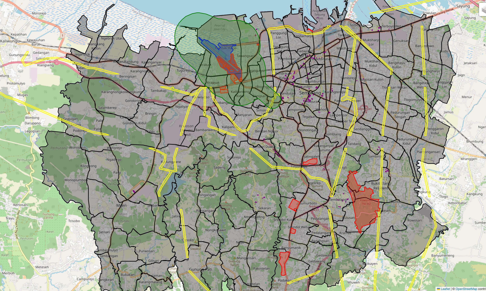
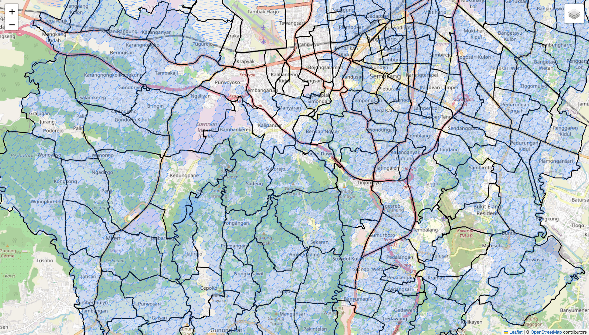
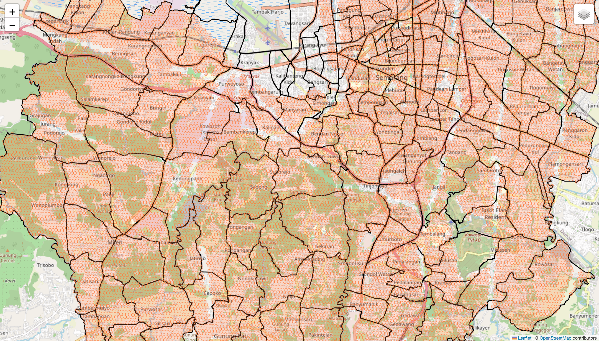
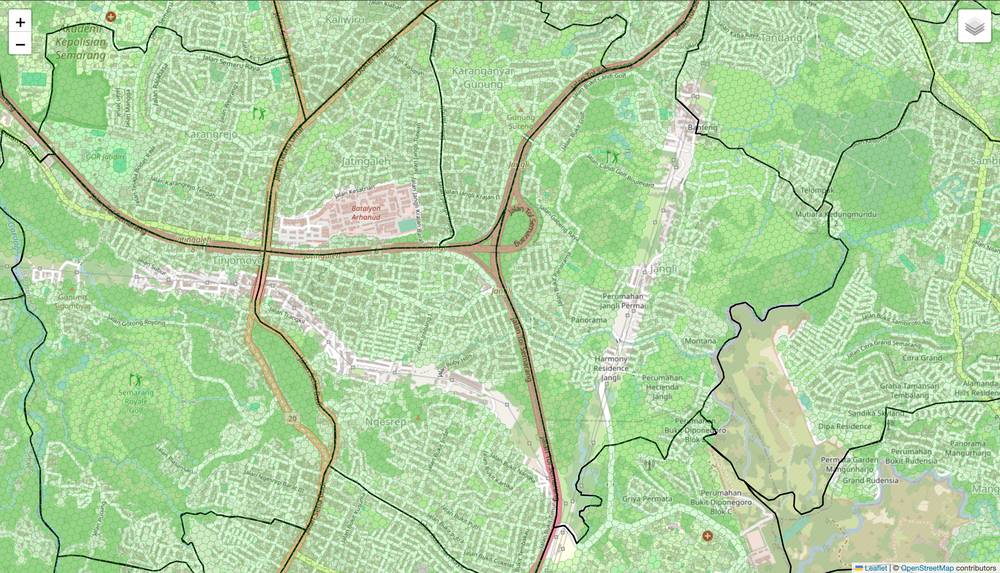
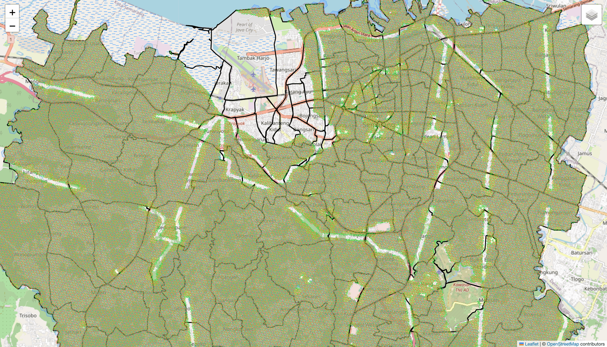
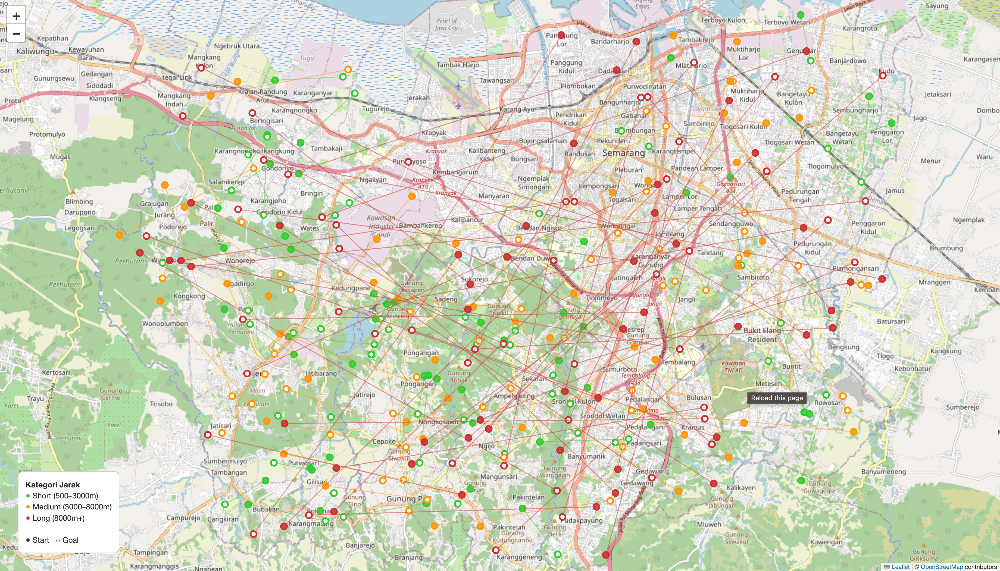

# uav-h3-pathfinding

## Graf H3 - Load Performance Report

### Benchmark Result
 
| Resolusi | Total Node | Total Edge | Avg Degree/Node | Load Time | Heap Alloc | Mem OS (Sys) | GC Cycles |
|----------|----------:|----------:|----------------:|----------:|----------:|-------------:|----------:|
| res9  | 2,848   | 14,842   | 5.21 | 18.727 ms  | 2.522 MB   | 12.908 MB  | 1 |
| res10 | 22,081  | 125,976  | 5.71 | 83.489 ms  | 20.231 MB  | 37.803 MB  | 4 |
| res11 | 160,121 | 943,232  | 5.89 | 575.018 ms | 157.035 MB | 203.998 MB | 7 |
 
### Scaling Factor (res9 → res11)
 
| Metrik     | res9 → res10 | res10 → res11 |
|------------|-------------:|--------------:|
| Node       | ~7.8x        | ~7.2x         |
| Edge       | ~8.5x        | ~7.5x         |
| Load Time  | ~4.5x        | ~6.9x         |
| Heap Alloc | ~8.0x        | ~7.8x         |

## Obstacles Visual

---

## Walkable Grid Visual

### Resolusi 9 

### Resolusi 10 

### Resolusi 11 

### All Reolusi

---

## Test Visual

---

